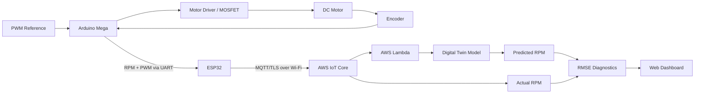
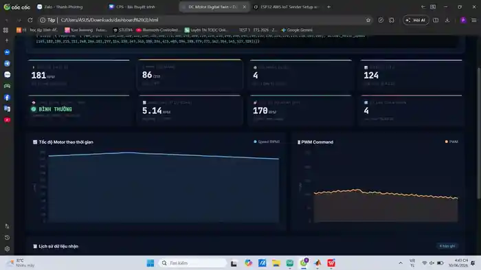

# DC Motor Cyber-Physical System
### Digital Twin · Embedded Control · ESP32 · AWS IoT · MATLAB/Simulink

A Cyber-Physical System (CPS) for real-time DC motor control, cloud monitoring, Digital Twin prediction, and RMSE-based off-board diagnostics.

**Tech Stack:** `Arduino Mega` · `ESP32` · `C/C++` · `UART` · `PWM` · `Wi-Fi` · `MQTT/TLS` · `AWS IoT Core` · `AWS Lambda` · `MATLAB/Simulink` · `Simscape`

> Course project — Cyber-Physical Systems, Faculty of Electrical and Electronics Engineering, HCMUTE, 06/2026.

## Team

| Member | Student ID |
|---|---:|
| Huỳnh Thanh Phương | 22139052 |
| Huỳnh Trọng Khiêm | 22139033 |
| Thái Hữu Lợi | 23139027 |
| Bùi Anh Duy | 23139007 |
| **Nguyễn Huỳnh Khánh Bảo** | **23139003** |

## 1. Project Overview

This project builds a **Digital Twin-based CPS for a DC motor**. The physical motor is controlled by an Arduino Mega, while an ESP32 acts as the IoT gateway that sends operating data to AWS IoT Core through MQTT/TLS.

A Digital Twin model runs in the cloud and predicts the expected motor speed. The system compares the **actual encoder speed** with the **predicted Digital Twin speed** and uses RMSE to detect abnormal operating conditions.

### Main Features

- Real-time DC motor speed control using **Feedforward + PID**.
- Quadrature encoder measurement for actual motor RPM.
- ESP32 gateway for cloud communication.
- Secure MQTT/TLS connection to **AWS IoT Core**.
- DC motor Digital Twin built with **MATLAB/Simulink + Simscape**.
- Cloud-side inference and diagnostics using **AWS Lambda**.
- RMSE-based fault detection.
- Real-time web dashboard for monitoring PWM, RPM, predicted speed, and system status.

### Project Demo

<p align="center">
  <a href="https://raw.githubusercontent.com/baonhk/CPS_CuoiKy/main/docs/demo/cps_demo_preview.mp4">
    
  </a>
</p>

<p align="center">
  <a href="https://raw.githubusercontent.com/baonhk/CPS_CuoiKy/main/docs/demo/cps_demo_preview.mp4"><b>▶ Watch MP4 Demo Preview</b></a>
</p>

The recorded demonstration shows the **physical DC motor prototype running beside the live monitoring dashboard**, allowing the measured RPM, PWM command, Digital Twin prediction, and diagnostic status to be observed while the hardware is operating.

The demo validates the complete end-to-end data path:

```text
DC Motor + Encoder
        ↓
Arduino Mega
        ↓ UART
ESP32 IoT Gateway
        ↓ MQTT/TLS
AWS IoT Core
        ↓
Digital Twin + Diagnostics
        ↓
Live Web Dashboard
```

---

## 2. System Architecture

The system is divided into three main layers:

| Layer | Components | Function |
|---|---|---|
| **Physical Layer** | Arduino Mega, MOSFET IRF3205, 12 V DC Motor, Encoder | Motor control and real-time speed acquisition |
| **Connectivity Layer** | Level Shifter, ESP32, Wi-Fi, MQTT/TLS, AWS IoT Core | Secure telemetry transmission to the cloud |
| **Digital Layer** | AWS Lambda, Digital Twin Model, RMSE Diagnostics, Web Dashboard | Prediction, condition monitoring, and fault detection |

### Data Flow



---

## 3. Hardware Prototype

<p align="center">
  
</p>

The physical prototype consists of:

- **Arduino Mega** — real-time motor control and encoder processing.
- **ESP32** — IoT gateway between the embedded controller and AWS.
- **12 V DC Motor + Encoder** — physical plant and feedback sensor.
- **Motor Driver / MOSFET stage** — drives the motor from PWM commands.
- **Level shifting/interface circuitry** — supports communication between 5 V and 3.3 V devices.

### Physical-Space Operation

1. Arduino Mega generates an 8-bit PWM control command.
2. The driver stage supplies the motor according to the PWM duty cycle.
3. The encoder generates pulses proportional to motor rotation.
4. Arduino calculates the actual motor speed in RPM.
5. RPM and PWM data are forwarded to ESP32.
6. ESP32 publishes telemetry to AWS IoT Core.

---

## 4. Digital Twin Operation

The DC motor model combines the electrical armature dynamics and mechanical rotor dynamics.

The model parameters are identified experimentally using an open-loop PWM sweep and **Simulink Parameter Estimation**.

The Digital Twin runs in parallel with the physical system:

```text
Physical Motor                  Digital Twin
-------------                  ------------
PWM Command  -----------------> Model Input
     |                              |
     v                              v
Actual RPM                    Predicted RPM
     |                              |
     +-------------+----------------+
                   |
                   v
               RMSE Error
                   |
          +--------+--------+
          |        |        |
        Normal   Warning  Abnormal
```

The diagnostic metric is:

```text
RMSE = sqrt( (1/N) * Σ(actual_RPM - predicted_RPM)^2 )
```

A large increase in RMSE indicates that the physical motor behavior is diverging from the expected Digital Twin response.

---

## 5. Real-Time Dashboard & Experimental Result

<p align="center">
  
</p>

The dashboard displays:

| Parameter | Purpose |
|---|---|
| **Actual Speed (RPM)** | Encoder speed measured from the real motor |
| **PWM Command** | Current 8-bit motor control command |
| **Predicted Speed (RPM)** | Digital Twin model output |
| **RMSE** | Error between physical and predicted speed |
| **Diagnostic Status** | Normal / warning / abnormal condition |
| **Data Points / Packets** | Received telemetry samples |

### Example Running Condition

From the experimental dashboard:

```text
Actual Motor Speed     : 181 RPM
PWM Command            : 86 / 255
Predicted Motor Speed  : 170 RPM
RMSE                   : 5.14 RPM
Diagnostic Status      : NORMAL
```

The actual and predicted speeds track each other closely under normal conditions, producing a low RMSE value.

### Fault Detection Concept

A target fault case is a **motor power degradation or loss condition**:

```text
PWM command remains normal
            |
            v
Physical motor speed decreases
            |
            v
Digital Twin still predicts expected response
            |
            v
Actual RPM and Predicted RPM diverge
            |
            v
RMSE increases
            |
            v
Warning / Abnormal state
```

This enables **off-board diagnostics**, where condition monitoring logic can be updated and executed in the cloud instead of being limited to the embedded controller.

---

## 6. Control & Signal Processing

### Encoder Processing

The encoder provides feedback for speed estimation. A low-pass filter is used to reduce quantization/noise effects:

```text
H(s) = 1 / (0.15s + 1)
```

### Motor Control

The Arduino Mega performs the real-time control loop using:

- Feedforward control
- PID feedback control
- 8-bit PWM output
- Encoder-based RPM feedback

This keeps timing-critical control on the embedded device while cloud services focus on monitoring, prediction, and diagnostics.

---

## 7. Cloud Communication

The ESP32 acts as an IoT gateway:

```text
Arduino Mega
    |
    | UART
    v
ESP32
    |
    | Wi-Fi
    | MQTT/TLS
    v
AWS IoT Core
    |
    +--> Telemetry / Device State
    |
    +--> AWS Lambda
             |
             v
       Digital Twin
             |
             v
       RMSE Diagnostics
             |
             v
        Web Dashboard
```

The cloud architecture separates **real-time control** from **high-level monitoring and diagnostics**, improving scalability and maintainability.

---

## 8. Repository Structure

```text
CPS_CuoiKy/
├── CPS_CuoiKy.prj
├── docs/
│   ├── images/
│   │   ├── hardware_model.webp
│   │   └── dashboard_result.webp
│   ├── demo/
│   │   ├── cps_demo_preview.gif
│   │   └── cps_demo_preview.mp4
│   ├── Baocao_2.docx
│   └── baibao.html
│
├── simulink/
│   ├── Chapter_9_Section_3_1.slx
│   ├── Chapter_9_Section_3_1_System_ID_Data.mat
│   ├── Chapter_9_Section_3_3.slx
│   ├── Chapter_9_Section_5.slx
│   ├── Chapter_9_Section_5_Script.m
│   ├── generated_code/
│   └── sfunctions/
│
├── esp32_aws_iot/
│   ├── esp32_aws_iot.ino
│   ├── filetest.ino
│   └── certs_template/
│       └── generate_certificates.py
│
├── README.md
└── LICENSE
```

---

## 9. How to Open the MATLAB Project

```matlab
prj = openProject('CPS_CuoiKy.prj');
```

MATLAB will load the project and add the required Simulink and S-Function directories to the path.

### Development Environment

- MATLAB / Simulink
- Simscape
- Simulink Coder
- Parameter Estimation
- Arduino IDE or PlatformIO
- Arduino Mega
- ESP32
- AWS IoT Core
- AWS Lambda
- Python 3

---

## 10. AWS IoT Certificate Security

The original development files contained device certificates and private keys.

These credentials **must never be committed to a public repository**.

Before using the project again:

1. Revoke any certificate that may have been exposed.
2. Create a new AWS IoT certificate and private key.
3. Keep the key files outside version control.
4. Use `certs_template/generate_certificates.py` to generate the local `certificates.h`.
5. Ensure credential files remain excluded by `.gitignore`.

---

## 11. Skills Demonstrated

This project demonstrates practical experience in:

- Embedded C/C++ firmware development
- Arduino Mega and ESP32 integration
- PWM motor control
- Encoder signal acquisition
- UART communication
- Wi-Fi and MQTT/TLS
- AWS IoT Core integration
- Cloud-based diagnostics
- MATLAB/Simulink and Simscape
- System identification
- Digital Twin modeling
- Real-time data visualization
- Cyber-Physical System architecture

---

## 12. Documentation

Additional project material:

- `docs/demo/cps_demo_preview.gif` — animated preview shown directly in the README.
- `docs/demo/cps_demo_preview.mp4` — clickable MP4 demo preview of the running hardware + dashboard.
- `docs/Baocao_2.docx` — full technical report.
- `docs/baibao.html` — project paper.
- `simulink/` — Digital Twin, system identification, and generated-code models.
- `esp32_aws_iot/` — ESP32 AWS IoT firmware.

---

## License

This project is released under the **MIT License**. See [LICENSE](./LICENSE).
